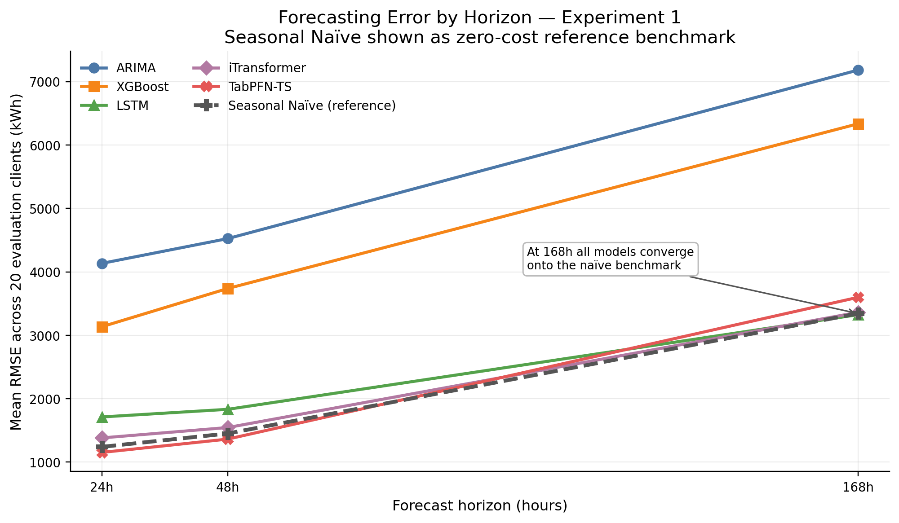
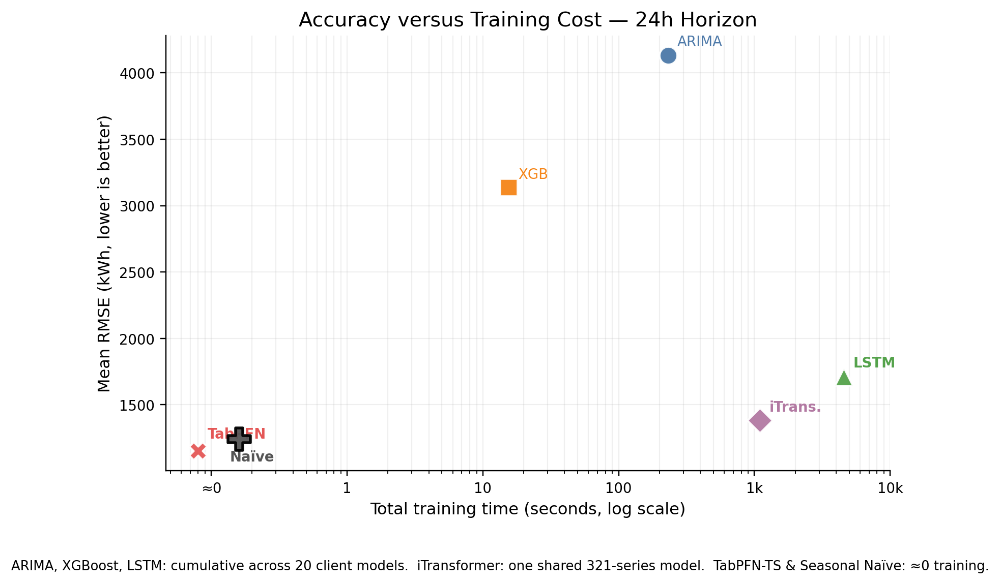
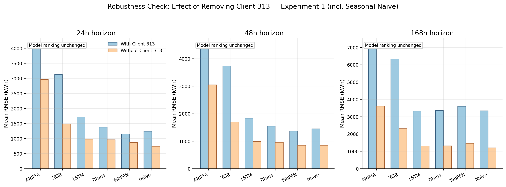
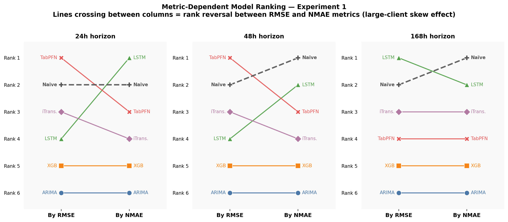
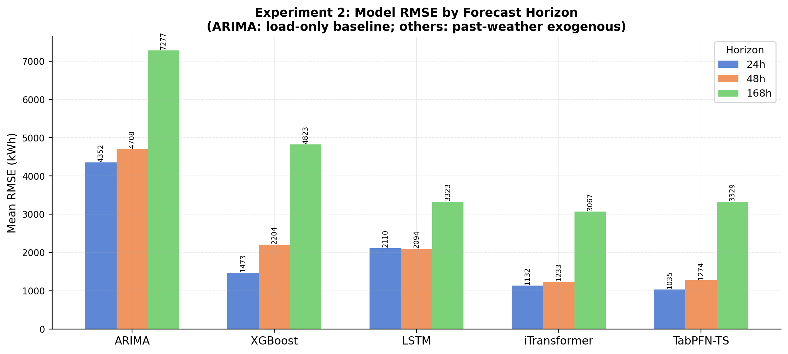
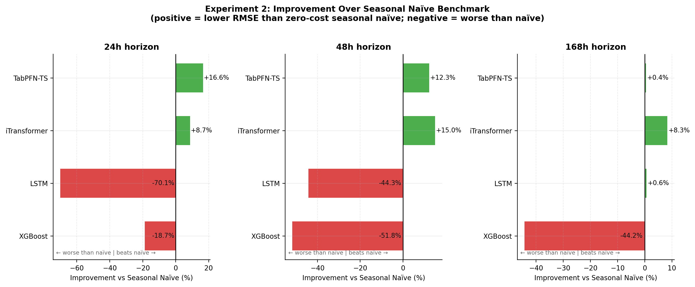
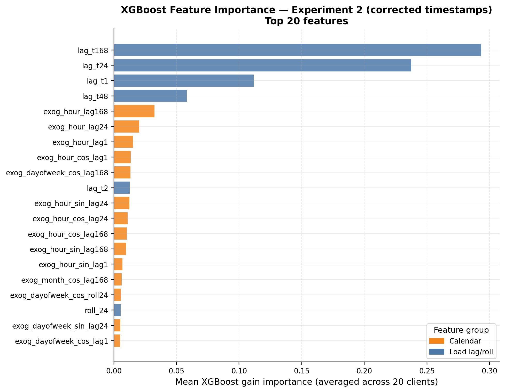
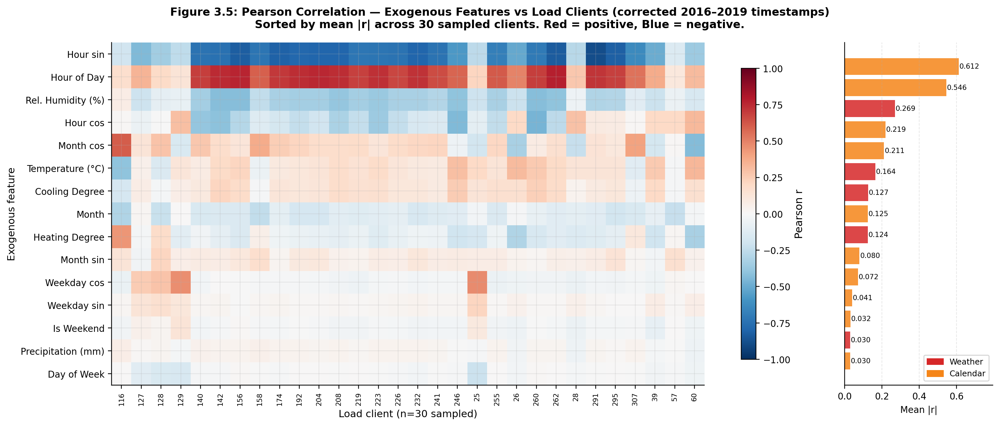
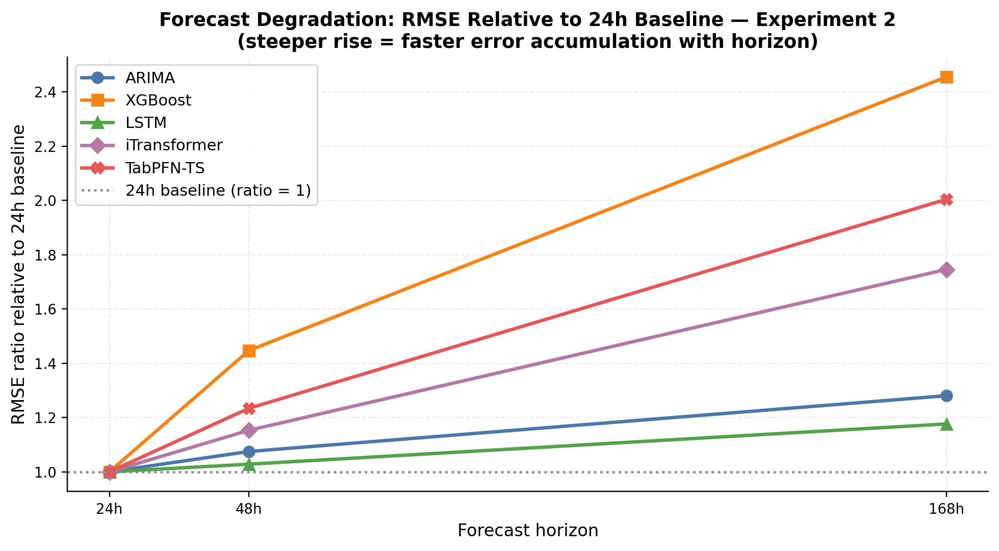

# Multivariate Electricity Demand Forecasting — Project Summary

**Author:** Tianqi (MSc Business Analytics, UCL × Avanade)  
**Date:** August 2026  
**Dataset:** UCI ECL (Electricity Load Diagrams 2016–2019, 321-client benchmark version)  
**Scope:** Two sequential experiments; six pipelines; 20 representative clients; horizons 24h / 48h / 168h

---

## 1. Problem Statement

Energy utilities and grid operators must forecast electricity demand across hundreds of consumer endpoints at multiple planning horizons. The core trade-off is accuracy vs interpretability vs compute cost. This project benchmarks five forecasting pipelines plus a weekly seasonal naïve benchmark on the standard ECL dataset, then extends the benchmark with real Lisbon weather and calendar covariates to test whether external signals change model rankings.

**Research questions:**
1. Under what conditions does iTransformer outperform classical and deep-learning baselines on ECL?
2. How do accuracy, training cost, and interpretability interact across model families?
3. Do weather covariates change model rankings, or does architecture dominate data richness?

---

## 2. Data Pipeline

### Experiment 1 — ECL (load + calendar features)

| Property | Value |
|---|---|
| Source | UCI ECL: 321 client series, hourly, 2016-07-01 to 2019-07-02 |
| Rows | 26,304 per series |
| Split | Train 70% / Val 10% / Test 20% (chronological, no shuffle) |
| Forecast origin | Fixed at val/test boundary (index 21,043) |
| Clients evaluated | 20 — top-10 by mean load + 10 random (seed 42) |
| Preprocessing | Per-client standardisation using training-set statistics |
| Horizons | 24h, 48h, 168h |

### Experiment 2 — ECL + Lisbon Weather Covariates

| Property | Value |
|---|---|
| Source | ECL + Open-Meteo API (Lisbon, hourly, matched to actual ECL timestamps) |
| New features | 5 weather vars + 10 calendar encodings = 15 exogenous columns |
| Total columns | 337 (321 load + 15 exog + timestamp) |
| Split | Identical 70/10/20 chronological split |
| Weather restriction | Only information available before the forecast origin enters the models |

**Weather features:** `temperature_2m`, `relative_humidity_2m`, `precipitation`, `heating_degree` (max(0, 18−T)), `cooling_degree` (max(0, T−22))  
**Calendar features:** `hour`, `day_of_week`, `month`, `is_weekend`, plus sin/cos cyclical encodings (×4)

---

## 3. Pipelines

| Pipeline | Paradigm | Exog support | Training unit | Hardware |
|---|---|---|---|---|
| Seasonal Naïve | Deterministic rule (lag 168) | No | None | — |
| ARIMA | Classical statistical | No | Per client | CPU |
| XGBoost | Gradient boosting | Yes (lag + calendar features) | Per client | CPU |
| LSTM | Recurrent deep learning | Yes | Per client | GPU (Tesla M60) |
| iTransformer | Inverted-attention Transformer | Yes | One shared model, all 321 series | GPU (Tesla M60) |
| TabPFN-TS | Zero-shot foundation model | Yes (in-context) | None (zero-shot inference) | CPU |

iTransformer config: `SEQ_LEN=96, PRED_LEN=168, D_MODEL=512, N_HEADS=8, E_LAYERS=3, D_FF=512, DROPOUT=0.1`

ARIMA and Seasonal Naïve participate in both experiments unchanged (load-only).  
TabPFN-TS, XGBoost, LSTM, and iTransformer receive weather covariates in Experiment 2.

---

## 4. Experiment 1 Results — Load History

### Mean RMSE by Pipeline and Horizon (kWh, averaged across 20 clients)

| Pipeline | RMSE 24h | RMSE 48h | RMSE 168h | Training time |
|---|---:|---:|---:|---:|
| Seasonal Naïve | 1,240.8 | — | — | 0s |
| ARIMA | 4,133.7 | 4,524.9 | 7,180.8 | 230.8s |
| XGBoost | 3,135.1 | 3,738.2 | 6,333.7 | 15.5s |
| LSTM | 1,712.3 | 1,832.9 | **3,343.5** | 4,544.1s (20 models) |
| iTransformer | 1,381.9 | 1,545.8 | 3,361.2 | 1,096.9s (1 shared model) |
| **TabPFN-TS** | **1,153.0** | **1,363.6** | 3,597.9 | 0s (zero-shot) |

Best at 24h / 48h: **TabPFN-TS** (zero-shot, no training on ECL).  
Best at 168h: **LSTM** (narrowly, margin < 1%).  
Seasonal naïve at 24h beats ARIMA, XGBoost, LSTM and iTransformer — trailing only TabPFN-TS.

Rankings change when switching from RMSE to NMAE (normalised by each client's mean load):  
at 24h, **LSTM** ranks first by NMAE; at 168h, **seasonal naïve** ranks first by NMAE.

### Key Figures — Experiment 1



*Figure 1 — Mean RMSE by pipeline across all three forecast horizons. Seasonal naïve shown as dashed reference.*



*Figure 2 — Accuracy vs training cost at 24h. iTransformer trains one shared model; LSTM trains 20 independent models.*



*Figure 3 — Robustness check: removing Client 313 (extreme industrial load) does not change any pipeline's rank.*



*Figure 4 — Pipeline rankings by raw RMSE vs normalised NMAE at each horizon. Crossing lines indicate metric-dependent rank changes.*

---

## 5. Experiment 2 Results — Weather Covariates Extension

### Mean RMSE by Pipeline and Horizon (kWh); Δ = change vs Experiment 1 at same horizon

| Pipeline | RMSE 24h | RMSE 48h | RMSE 168h | Δ 24h | Δ 48h | Δ 168h |
|---|---:|---:|---:|---:|---:|---:|
| Seasonal Naïve (unchanged) | 1,240.8 | — | — | — | — | — |
| ARIMA (load-only re-run) | 4,352.5 | 4,707.9 | 7,277.5 | +5.3% | +4.1% | +1.3% |
| XGBoost | 1,575.1 | 2,604.9 | 5,109.8 | **−53%** | **−41%** | **−24%** |
| LSTM | 1,964.3 | 2,074.1 | 3,627.3 | **+23%** | +14% | ≈0% |
| iTransformer | 1,223.7 | 1,324.8 | **3,057.3** | −11% | −14% | −9% |
| **TabPFN-TS** | **1,034.2** | **1,199.0** | 3,354.7 | −10% | −12% | −7% |

**Key result:** Weather covariates affect pipelines very differently.  
XGBoost gains the most (−53% at 24h). **LSTM deteriorates** with weather (direct multi-output training is disrupted by the added input dimensions). iTransformer and TabPFN-TS improve moderately.

**Ranking shift at 168h:** Unlike Experiment 1 where LSTM led at 168h, in Experiment 2 **iTransformer leads** at 168h (3,057.3 vs LSTM 3,627.3). Weather covariates change the long-horizon winner.

### Key Figures — Experiment 2



*Figure W1 — RMSE by pipeline: load-only vs weather extension, all horizons.*



*Figure W2 — Performance relative to the seasonal naïve benchmark. Values above zero = better than naïve.*



*Figure W3 — XGBoost feature importance under weather extension. Lag features and calendar features dominate; humidity has the strongest weather signal.*



*Figure W4 — Pearson correlation between exogenous features and 30 sampled load clients. Calendar features (hour of day) show the strongest systematic correlation.*



*Figure W5 — Forecast accuracy degradation with horizon. All pipelines lose accuracy as horizon increases, but at different rates.*

---

## 6. Key Conclusions

### C1 — Transformer advantage is conditional, not universal

iTransformer outperforms LSTM and other conventional baselines most clearly when (a) cross-series information is available and (b) the forecast horizon is short (24h, 48h). At 168h without weather, LSTM has a marginally lower RMSE. The advantage does not hold uniformly across horizons, metrics, or information regimes.

### C2 — The seasonal naïve benchmark is harder to beat than typically reported

A zero-cost rule that copies the value from one week earlier outperforms ARIMA, XGBoost and LSTM at 24h in Experiment 1, and leads by normalised error (NMAE) at 168h in Experiment 1. Complex models add value over this benchmark only at specific horizons and under specific conditions. Any comparison that omits a seasonal naïve benchmark risks overstating the practical benefit of complex architectures.

### C3 — Weather covariates change the long-horizon winner

At 168h, adding weather shifts the winner from LSTM (Exp 1) to iTransformer (Exp 2). This is the only ranking change across the two experiments. At 24h and 48h, the top-2 pipelines (TabPFN-TS and iTransformer) remain unchanged.

### C4 — LSTM is the most sensitive pipeline to added covariates

LSTM is the only pipeline that deteriorates substantially with weather (24h RMSE +23%). Direct multi-output training over an expanded input space appears to destabilise the per-client models at shorter horizons. This is a practical risk in production settings where covariate availability is variable.

### C5 — TabPFN-TS is competitive at short horizons without any ECL training

TabPFN-TS records the lowest 24h and 48h RMSE in both experiments without gradient-based training on ECL data. This is a meaningful practical result for rapid-deployment settings where retraining infrastructure is not available.

### C6 — XGBoost is the most interpretable pipeline that benefits from weather

XGBoost gains the largest absolute improvement from weather features (−53% at 24h) and supports SHAP explanations over named lag, calendar and weather inputs. For advisory or regulated deployments, XGBoost is the clearest combination of accuracy improvement and post-hoc interpretability.

### C7 — Forecast-origin alignment is a silent failure mode

Two pipelines (ARIMA and TabPFN-TS) initially produced RMSE approximately three times larger than the corrected values because forecasts were generated from the end of the training split rather than the val/test boundary. The code executed without error. Correct evaluation requires explicit index-level verification of the forecast origin.

---

## 7. Model Selection Guide

```
Need lowest raw RMSE at 24h or 48h?
  → TabPFN-TS (zero training cost; strong short-horizon performance)

Need lowest raw RMSE at 168h with weather covariates?
  → iTransformer (one shared model; cross-series attention leverages exogenous signal)

Need SHAP-level attribution over named features?
  → XGBoost (largest improvement from weather; most interpretable exog-capable model)

Highly regulated; must inspect model coefficients?
  → ARIMA (accept substantially lower accuracy)

Need a zero-cost deployment floor?
  → Seasonal Naïve (competitive at all horizons under normalised error)
```

---

## 8. Figure Index

| ID | Path | Description |
|---|---|---|
| F1 | `ecl_main_experiment/results/figures_final/figure_1_rq1_rmse_by_horizon.png` | RMSE by pipeline, all horizons, Exp 1 |
| F2 | `ecl_main_experiment/results/figures_final/figure_2_rq2_accuracy_vs_training_time.png` | Accuracy vs training cost, 24h |
| F3 | `ecl_main_experiment/results/figures_final/figure_3_client313_robustness.png` | Client 313 robustness check |
| F4 | `ecl_main_experiment/results/figures_final/figure_8_metric_dependent_ranking.png` | RMSE vs NMAE ranking comparison |
| W1 | `ecl_weather_covariates_experiment/outputs/figures_final/fig_01_rmse_by_model.png` | RMSE by pipeline, weather extension |
| W2 | `ecl_weather_covariates_experiment/outputs/figures_final/fig_02_improvement_over_naive.png` | Performance vs seasonal naïve benchmark |
| W3 | `ecl_weather_covariates_experiment/outputs/figures_final/fig_03_xgboost_feature_importance.png` | XGBoost feature importance |
| W4 | `ecl_weather_covariates_experiment/outputs/figures_final/fig_04_feature_load_correlation.png` | Feature-load Pearson correlation heatmap |
| W5 | `ecl_weather_covariates_experiment/outputs/figures_final/fig_06_forecast_degradation.png` | Forecast accuracy degradation by horizon |
| W6 | `ecl_weather_covariates_experiment/outputs/figures_final/fig_07_actual_vs_predicted.png` | Actual vs predicted time series sample |

---

*All numbers derive from result files in `ecl_main_experiment/results/raw_metrics/` and `ecl_weather_covariates_experiment/outputs/raw_metrics/`. Percentage improvements use Experiment 1 as the base. ARIMA Δ figures reflect independent re-estimation, not covariate effects.*
