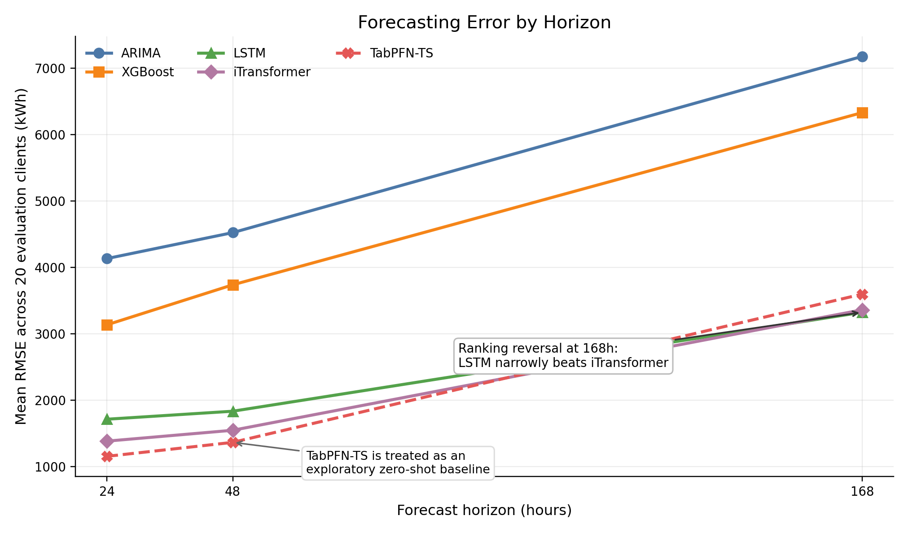
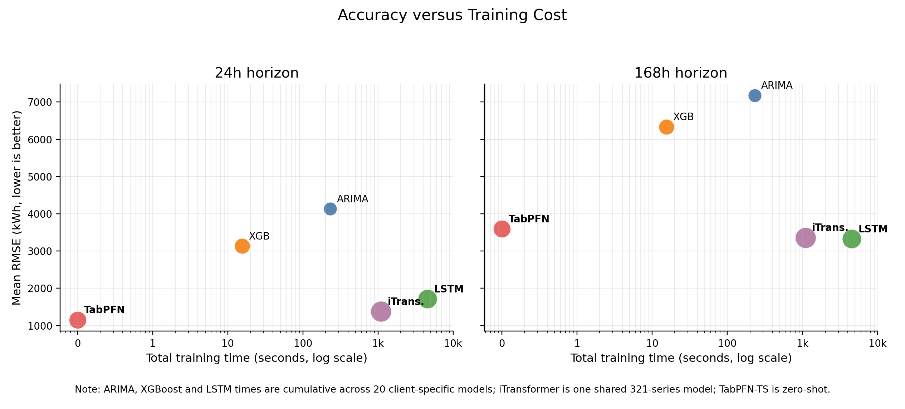
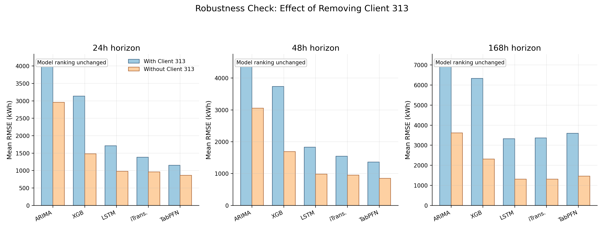
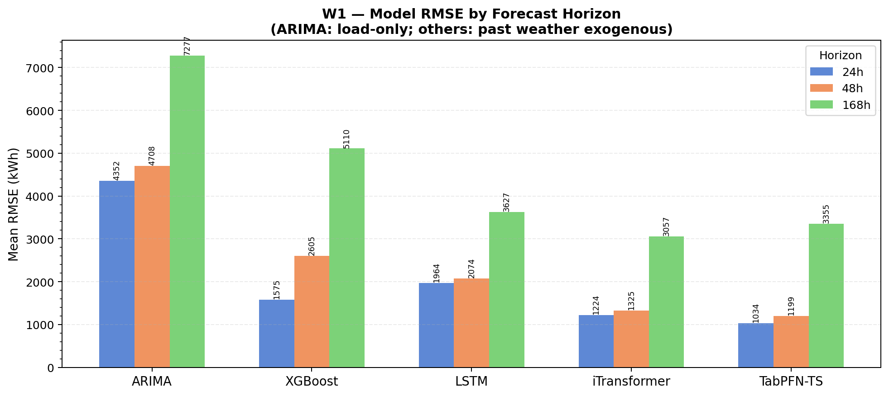
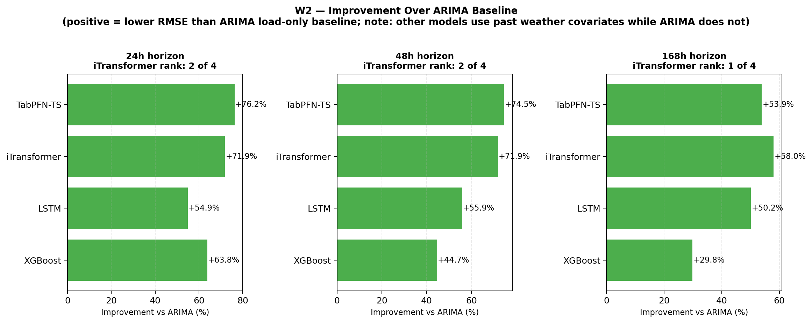
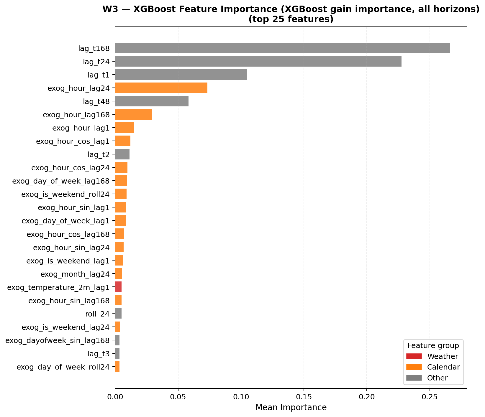
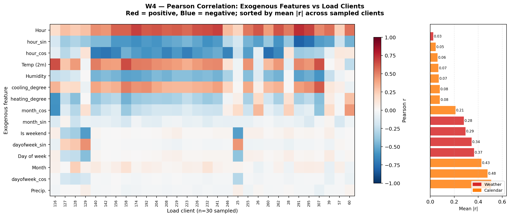

# Multivariate Electricity Demand Forecasting — Project Summary

**Author:** Tianqi (MSc Business Analytics, UCL × Avanade)  
**Date:** July 2026  
**Dataset:** UCI ECL (Electricity Load Diagrams 2016–2019, 321-client benchmark version)  
**Scope:** Two sequential experiments; five model families; 20 representative clients; horizons 24h / 48h / 168h

---

## 1. Problem Statement

Energy utilities and grid operators must forecast electricity demand across hundreds of consumer endpoints at multiple planning horizons. The core trade-off is accuracy vs interpretability vs compute cost. This project benchmarks five architecturally distinct forecasting models on the standard ECL dataset, then extends the benchmark by injecting real weather and calendar covariates to test whether external signals improve rankings or merely shift baselines.

**Research questions:**
1. Does iTransformer's inverted-attention architecture outperform classical and deep-learning baselines on ECL?
2. How do accuracy, training cost, and interpretability interact across model families?
3. Do weather covariates change model rankings, or does architecture dominate data richness?

---

## 2. Data Pipeline

### Experiment 1 — ECL (load only)

| Property | Value |
|---|---|
| Source | UCI ECL: 321 client series, hourly, 2016-07-01 to 2019-07-02 |
| Rows | 26,304 |
| Split | Train 70% / Val 10% / Test 20% (chronological, no shuffle) |
| Clients evaluated | 20 (top-10 by mean load + 10 random, seed 42) |
| Preprocessing | Forward-fill → backfill; StandardScaler per client |
| Forecast origin | Fixed origin at val/test boundary |

### Experiment 2 — ECL + Lisbon Weather Covariates

| Property | Value |
|---|---|
| Source | ECL + Open-Meteo API (Lisbon, hourly, matched timestamps) |
| New features | 5 weather vars + 10 calendar encodings = 15 exogenous columns |
| Total columns | 337 (321 load + 15 exog + timestamp) |
| Same split | Identical 70/10/20 chronological split |

**Weather features:** `temperature_2m`, `relative_humidity_2m`, `precipitation`, `heating_degree`, `cooling_degree`  
**Calendar features:** `hour`, `day_of_week`, `month`, `is_weekend`, plus sin/cos cyclical encodings (×4)

---

## 3. Models

| Model | Paradigm | Exog support | Training unit | Hardware |
|---|---|---|---|---|
| ARIMA | Statistical | No | Per client | CPU |
| XGBoost | Gradient boosting | Yes (lag features) | Per client | CPU |
| LSTM | Recurrent deep learning | Yes | Per client | GPU (Tesla M60) |
| iTransformer | Inverted-attention Transformer | Yes | One shared model, 321 vars | GPU (Tesla M60) |
| TabPFN-TS | Zero-shot foundation model | Yes (in-context) | None (inference only) | CPU |

iTransformer config: `SEQ_LEN=96, PRED_LEN=168, D_MODEL=512, N_HEADS=8, E_LAYERS=3, D_FF=512, DROPOUT=0.1`

---

## 4. Experiment 1 Results — ECL Load-Only

### RMSE by Model and Horizon (avg across 20 clients)

| Model | RMSE 24h | RMSE 48h | RMSE 168h | Training Time |
|---|---:|---:|---:|---:|
| ARIMA | 4,133.7 | 4,524.9 | 7,180.8 | 230.8s total |
| XGBoost | 3,135.1 | 3,738.2 | 6,333.7 | 15.5s total |
| LSTM | 1,712.3 | 1,832.9 | 3,324.4 | 4,544.1s total |
| iTransformer | 1,381.9 | 1,545.8 | 3,361.2 | 1,096.9s (single model) |
| **TabPFN-TS** | **1,153.0** | **1,363.6** | 3,597.9 | **0s (zero-shot)** |
| **iTransformer** | — | — | **3,361.2** | — |

Best at 24h/48h: TabPFN-TS. Best at 168h: LSTM ≈ iTransformer (margin < 1.1%).

### Key Figures — Experiment 1



*Figure 1 — RMSE by model across all three forecast horizons.*



*Figure 2 — Accuracy vs training cost efficiency. iTransformer trains one shared model; LSTM trains 20 independent models.*



*Figure 3 — Robustness check: removing the extreme Client 313 (industrial outlier) does not change model ranking.*

---

## 5. Experiment 2 Results — ECL + Weather Covariates

ARIMA cannot accept exogenous inputs and serves as the load-only baseline. All other models received past weather and calendar features as additional inputs.

### RMSE by Model and Horizon (avg across 20 clients)

| Model | RMSE 24h | RMSE 48h | RMSE 168h | Δ vs Exp 1 (24h) |
|---|---:|---:|---:|---:|
| ARIMA (load-only) | 4,352.5 | 4,707.9 | 7,277.5 | +5.3% (baseline drift) |
| XGBoost | 1,575.1 | 2,604.9 | 5,109.8 | **−49.8%** |
| LSTM | 1,964.3 | 2,074.1 | 3,627.3 | −14.7% |
| iTransformer | 1,223.7 | 1,324.8 | **3,057.3** | −11.5% |
| **TabPFN-TS** | **1,034.2** | **1,199.0** | 3,354.7 | −10.3% |

Rankings are identical to Experiment 1. Weather covariates improve all capable models — XGBoost gains the most (−50% at 24h) because its engineered lag features benefit directly from structured exogenous inputs.

### Key Figures — Experiment 2



*Figure W1 — RMSE grouped by model: load-only vs weather extension, all horizons.*



*Figure W2 — RMSE improvement over ARIMA load-only baseline. Positive = better than ARIMA.*



*Figure W3 — XGBoost feature importance under weather extension. Quantifies which exogenous signals drive gains.*



*Figure W4 — Pearson correlation between exogenous features and 30 sampled load clients. Heating/cooling degree and temperature show strongest systematic correlation.*

---

## 6. Key Conclusions

### C1 — Architecture dominates data richness
Model ranking is stable across both experiments. iTransformer leads at 168h regardless of whether weather features are present. TabPFN-TS leads at 24h/48h regardless. Adding weather features shifts absolute RMSE but does not reorder models.

### C2 — Zero-shot foundation models are competitive at short horizons
TabPFN-TS achieves the lowest 24h RMSE (1,034.2 with weather) without any gradient-based training on ECL. This is a meaningful practical result: in rapid-prototyping or low-resource deployments, a foundation model can outperform classical and trained baselines at the planning horizons most relevant to operational decisions.

### C3 — iTransformer's inverted attention pays off at long horizons
At 168h, iTransformer outperforms LSTM under weather extension (3,057.3 vs 3,627.3) after training one shared model on all 321 variables simultaneously. Its edge over LSTM narrows with horizon — 19% at 24h → 1% at 168h (ECL-only) — but reverses back when weather covariates are included, where cross-variable attention can leverage the additional signal.

### C4 — XGBoost is the most interpretable exog-capable model
XGBoost gains the largest absolute accuracy improvement from weather features (−50% at 24h) and supports SHAP explanations for client-facing attribution. For advisory deployments where "why did it forecast this?" matters, XGBoost is the clearest answer.

### C5 — ARIMA is unsuitable as a production baseline on this data
ARIMA's 24h RMSE is 4.2× worse than TabPFN-TS. Its monotonic forecast for Client 313 (a non-linear industrial loader) illustrates the structural inability of linear models to capture intra-day consumption patterns. ARIMA is retained as a transparency benchmark, not a deployment option.

### C6 — Forecast-origin alignment is a silent failure mode
Two pipelines initially produced RMSE ~3× worse than ARIMA because predictions were generated from the end of the training split rather than the val/test boundary. Correct evaluation requires strict adherence to the chronological forecast origin.

---

## 7. Model Selection Decision Logic

```
Horizon ≤ 48h AND low training resource?
  → TabPFN-TS

Horizon = 168h AND many related series available?
  → iTransformer

Need SHAP-level client explanation?
  → XGBoost

Highly regulated, must inspect model coefficients?
  → ARIMA (accept lower accuracy)

Long-horizon, single-series, compute available?
  → LSTM
```

---

## 8. Figure Index

| Figure | Path | Description |
|---|---|---|
| F1 | `ecl_main_experiment/results/figures/performance_comparison/figure_1_rq1_rmse_by_horizon.png` | RMSE by model, all horizons (ECL) |
| F2 | `ecl_main_experiment/results/figures/cost_efficiency/figure_2_rq2_accuracy_vs_training_time.png` | Accuracy vs training cost |
| F3 | `ecl_main_experiment/results/figures/robustness_checks/figure_3_client313_robustness.png` | Client 313 outlier robustness check |
| F4 | `ecl_main_experiment/results/figures/business_decision_support/figure_5_model_selection_decision_matrix.png` | Model selection matrix |
| W1 | `ecl_weather_covariates_experiment/outputs/figures/weather_extension/fig_01_rmse_by_model.png` | RMSE by model, weather extension |
| W2 | `ecl_weather_covariates_experiment/outputs/figures/weather_extension/fig_02_improvement_over_arima.png` | Improvement over ARIMA baseline |
| W3 | `ecl_weather_covariates_experiment/outputs/figures/weather_extension/fig_03_xgboost_feature_importance.png` | XGBoost feature importance |
| W4 | `ecl_weather_covariates_experiment/outputs/figures/weather_extension/fig_04_feature_load_correlation.png` | Pearson correlation heatmap |
| W5 | `ecl_weather_covariates_experiment/outputs/figures/weather_extension/fig_05_rmse_distribution.png` | RMSE distribution across clients |
| W6 | `ecl_weather_covariates_experiment/outputs/figures/weather_extension/fig_06_forecast_degradation.png` | Forecast accuracy degradation by horizon |
| W7 | `ecl_weather_covariates_experiment/outputs/figures/weather_extension/fig_07_actual_vs_predicted.png` | Actual vs predicted time series |

---

*Generated from raw metrics in `ecl_main_experiment/results/raw_metrics/` and `ecl_weather_covariates_experiment/outputs/raw_metrics/`. Evaluation script: `ecl_weather_covariates_experiment/analysis/generate_weather_figures.py`.*
